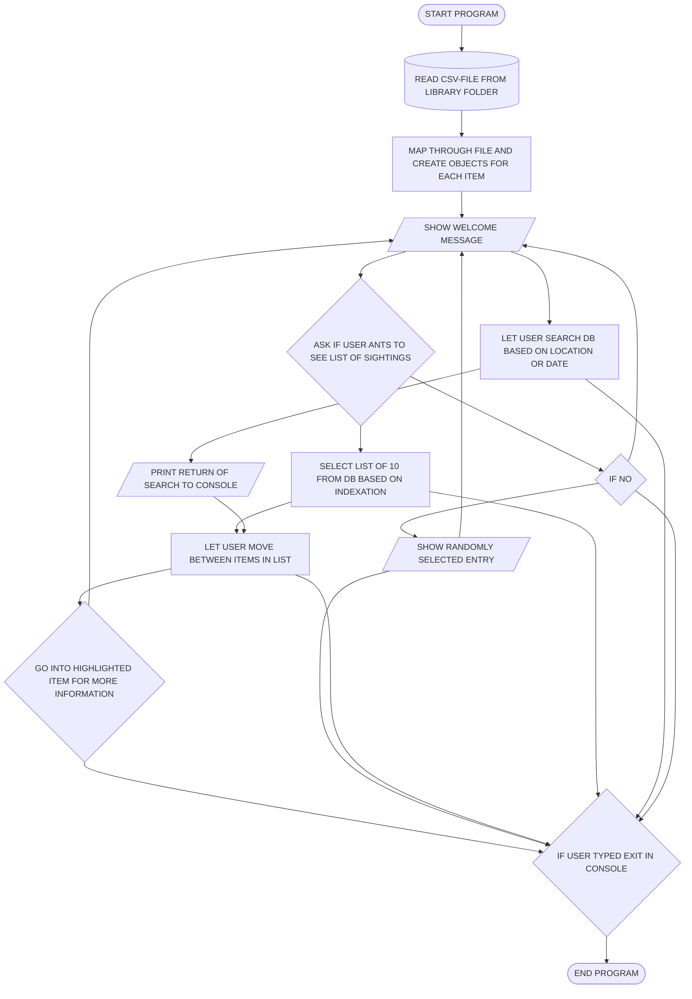

# Learning about Linq

This project is dedicated to learning the basics of how to use Linq in C# to query and work with datasets.

## Flowchart

```mermaid
graph TD
A([START PROGRAM]) --> B[(READ CSV-FILE FROM LIBRARY FOLDER)];
B --> C[MAP THROUGH FILE AND CREATE OBJECTS FOR EACH ITEM];
C --> D[/SHOW WELCOME MESSAGE/];
D --> E{ASK IF USER ANTS TO SEE LIST OF SIGHTINGS};
D --> F[LET USER SEARCH DB BASED ON LOCATION OR DATE];
E --> G{IF NO};
E --> H[SELECT LIST OF 10 FROM DB BASED ON INDEXATION];
F --> I[/PRINT RETURN OF SEARCH TO CONSOLE/];
H --> J[LET USER MOVE BETWEEN ITEMS IN LIST];
I --> J;
G --> K[/SHOW RANDOMLY SELECTED ENTRY/];
K --> D;
J --> L{GO INTO HIGHLIGHTED ITEM FOR MORE INFORMATION};
L --> D;
G --> D;
L --> N{IF USER TYPED EXIT IN CONSOLE};
K --> N;
J --> N;
H --> N;
F --> N;
G --> N;
N --> P([END PROGRAM]);
```
